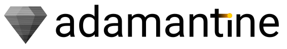

`adamantine` is a thermomechanical code for additive manufacturing. It is based
on [deal.II](https://www.dealii.org),
[ArborX](https://github.com/arborx/ArborX),
[Trilinos](https://www.trilinos.github.io), and [Kokkos](https://kokkos.org).
`adamantine` can simulate the thermomechanical evolution an object undergoes
during the manufacturing process. It can handle materials in three distinct
phases (solid, liquid, and powder) to accurately reflect the physical state
during manufacturing. Experimental data can be used to improve the simulation
through the use of [Ensemble Kalman
filter](https://en.wikipedia.org/wiki/Ensemble_Kalman_filter).

## Installation
Installing `adamantine` requires:
* MPI
* A compiler that support C++17
* CMake: 3.15 or later
* Boost: 1.70.0 or later
* ArborX: 1.4.1 or later
* Trilinos: 14.4.0 or later. If you want to *adamantine* to read an Exodus mesh,
  you need to enable SEACAS support.
* deal.II: 9.5 for the 1.0 release and 9.6 for the development version. You need to compile deal.II with MPI, p4est, and ArborX support.
* Caliper: 2.10 or later. Optional dependency to profile `adamantine`.

An example on how to install all the dependencies can be found in
`ci/Dockerfile`.

To configure `adamantine` use:
```CMake
cmake \
  -D CMAKE_BUILD_TYPE=Release \
  -D DEAL_II_DIR=/path/to/dealii \
  -DBOOST_DIR=/path/to/boost \
/path/to/source/dir
```
Then simply use `make`. This will compile `adamantine` and create an executable
in a newly created `bin` subdirectory. You will find in this subdirectory the
executable and an example of input files.

The list of configuration options is:
* ADAMANTINE\_ENABLE\_ADIAK=ON/OFF
* ADAMANTINE\_ENABLE\_CALIPER=ON/OFF
* ADAMANTINE\_ENABLE\_COVERAGE=ON/OFF
* ADAMANTINE\_ENABLE\_TESTS=ON/OFF
* BOOST\_DIR=/path/to/boost
* CMAKE\_BUILD\_TYPE=Debug/Release
* CALIPER\_DIR=/path/to/caliper (optional)
* DEAL\_II\_DIR=/path/to/dealii

## Docker 
The Docker image containing the latest version of `adamantine` can be pulled
using
```bash
docker pull rombur/adamantine:latest
```
The 1.0 release version is available using
```bash
docker pull rombur/adamantine:1.0
```
To start an interactive container use
```
docker run --rm -it rombur/adamantine:1.0 bash
```
You will find `adamantine` in `/home/adamantine/bin`. You can mount a folder
into a Docker image using
```
docker run --rm -it -v /path/to/compute/folder:/path/to/image/folder rombur/adamantine:1.0 bash
```

## NIX
The instructions to install `adamantine` using NIX can be found [here](https://github.com/adamantine-sim/adamantine/blob/master/NIX.md).

## Run
After compiling `adamantine`, you can run a simulation using
```bash
mpirun -n 2 ./adamantine --input-file=input.info
```
Note that the name of the input file is totally arbitrary, `my_input_file` is as
valid as `input.info`.

There is a [known bug](https://github.com/adamantine-sim/adamantine/issues/130)
when using multithreading. To deactivate multithreading use
```bash
export DEAL_II_NUM_THREADS=1
```
If you use our Docker image, the variable is already set.

### Input file
`adamantine` supports Boost INFO format and json. The input file is assumed to use
the INFO format unless the file extension is `.json`. An example of an input
file can be found
[here](https://github.com/adamantine-sim/adamantine/blob/master/tests/data/HourGlass_AOP.info).

The following options are available:
* boundary (required):
  * type: type of boundary: adiabatic, radiative, or convective. Multiple types
  can be chosen simultaneously by separating them by comma (required)
* physics (required):
  * thermal: thermal simulation: true or false (required)
  * mechanical: mechanical simulation; if both thermal and mechanical parameters
   are true, solve a coupled thermo-mechanics problem : true or false (required)
* discretization (required):
  * thermal:
    * fe\_degree: degree of the finite element used (required if physics.thermal
    is true)
    * quadrature: quadrature used: gauss or lobatto (default value: gauss)
  * mechanical:
    * fe\_degree: degree of the finite element used (required if
    physics.mechanical is true)
* geometry (required):
  * dim: the dimension of the problem (2 or 3, required)
  * material\_height: below this height the domain contains material. Above this
  height the domain is empty. The height is in meters (default value: 1e9)
  * use\_powder: the additive manufacturing process use powder: true or false
  (default value: false)
  * if use\_powder is true:
    * powder\_layer: thickness of the initial layer of powder in meters (required)
  * material\_deposition: material is deposed during the simulation: true or
  false (default value: false)
  * if material\_deposition is true:
    * material\_deposition\_method: file, scan\_paths
    * if material\_deposition\_method is file:
        * material\_deposition\_file: material deposition filename
    * if material\_deposition\_method is scan\_paths:
        * deposition\_length: length of material deposition boxes along the scan direction in meters
        * deposition\_width: width of material deposition boxes in meters (in the plane of the material, normal to the scan direction, 3D only)
        * deposition\_height: height of material deposition boxes in meters (out of the plane of the material)
        * deposition\_lead\_time: amount of time before the scan path reaches a point that the material is added in seconds
        * deposition\_time: using this option, the material is added in bigger lumps in seconds (optional)
  * import\_mesh: true or false (required)
  * if import\_mesh is true:
    * mesh\_file: The filename for the mesh file (required)
    * mesh\_format: abaqus, assimp, unv, ucd, dbmesh, gmsh, tecplot, xda, vtk,
    vtu, exodus, or default, i.e., use the file suffix to try to determine the
    mesh format (required)
    * mesh\_scale\_factor: Apply a uniform scaling factor to the mesh (e.g. if the mesh is defined in mm or inches instead of m), (default value: 1) **[removed in 1.1, use units.mesh instead]**
    * reset\_material\_id: Clear the material IDs defined in the mesh and set them all to zero so all material properties are given by the `material\_0` input block: true or false (default value: false)
  * if import\_mesh is false:
    * length: the length of the domain in meters (required)
    * height: the height of the domain in meters (required)
    * width: the width of the domain in meters (only in 3D)
    * length\_origin: the reference location in the length direction (default value: 0)
    * height\_origin: the reference location in the height direction (default value: 0)
    * width\_origin: the reference location in the width direction (only in 3D) (default value: 0)
    * length\_divisions: number of cell layers in length (default value: 10)
    * height\_divisions: number of cell layers in the height (default value: 10)
    * width\_divisions: number of cell layers in width (only in 3D) (default value: 10)
* materials (required):
  * n\_materials: number of materials (required)
  * property\_format: format of the material property: `table` or `polynomial`. For `table`, the format of the matieral properties is as follows: `temperature_1,value_1|temperature_2,value_2|...` with `temperature_1 < temperature_2`. For `polynomial`, the format is as follows: `coeff_0,coeff_1,coeff_2` where `coeff_0` is the coefficient of `T^0`, `coeff_1` is the coefficient of `T^1`, etc  (required)
  * initial\_temperature: initial temperature of all the materials in kelvins (default value: 300)
  * new\_material\_temperature: temperature of all the material that is being added during the process in kelvins (default value: 300)
  * material\_X: property tree for the material with number X
  * material\_X.Y: property tree where Y is either liquid, powder, or solid
  (one is required)
  * material\_X.Y.Z: Z is either density in kg/m^3, specific\_heat in J/(K\*kg),
  thermal\_conductivity\_x, resp. y or z, in the direction x, resp. y or z (in 2D only x and z are used), in W/(m\*K), emissivity,
  or convection\_heat\_transfer\_coef in W/(m^2\*K) (optional)
  * material\_X.A: A is either solidus in kelvins, liquidus in kelvins, latent\_heat
  in J/kg, radiation\_temperature\_infty in kelvins, or convection\_temperature\_infty
  in kelvins (optional)
* memory\_space (optional): device (use GPU if Kokkos compiled with GPU support) or host (use CPU) (default value: host)
* post\_processor (required):
  * filename\_prefix: prefix of output files (required)
  * time\_steps\_between\_output: number of time steps between the
  fields being written to the output files (default value: 1)
  * additional\_output\_refinement: additional levels of refinement for the output (default: 0)
* refinement (required):
  * n\_refinements: number of times the cells on the paths of the beams are refined (default value: 2)
  * coarsen\_after\_beam: whether to coarsen cells where the beam has already passed (default value: false)
  * time\_steps\_between\_refinement: number of time steps after which the
  refinement process is performed (default value: 2)
* sources (required):
  * n\_beams: number of heat source beams (required)
  * beam\_X: property tree for the beam with number X
  * beam\_X.type: type of heat source: goldak, electron\_beam, or cube (required)
  * beam\_X.scan\_path\_file: scan path filename (required)
  * beam\_X.scan\_path\_file\_format: format of the scan path: segment or
  event\_series (required)
  * beam\_X.max\_power: maximum power of the beam in watts (required)
  * beam\_X.depth: maximum depth reached by the electron beam in meters (required)
  * beam\_X.absorption\_efficiency: absorption efficiency of the beam equivalent
  to energy\_conversion\_efficiency * control\_efficiency for electon beam. Number
  between 0 and 1 (required).
  * beam\_X.diameter: diameter of the beam in meters (default value: 2e-3)
* time\_stepping (required):
  * method: name of the method to use for the time integration: forward\_euler,
  rk\_third\_order, rk\_fourth\_order, backward\_euler, implicit\_midpoint, 
  crank\_nicolson, or sdirk2 (required)
  * scan\_path\_for\_duration: if the flag is true, the duration of the simulation is determined by the duration of the scan path. In this case the scan path file needs to contain SCAN\_PATH\_END to terminate the simulation. If the flag is false, the duration of the simulation is determined by the duration input (default value: false) **[since 1.1]**
  * duration: duration of the simulation in seconds (required if scan\_path\_for\_duration is false) **[required for 1.0]**
  * time\_step: length of the time steps used for the simulation in seconds (required)
  * for implicit method:
    * max\_iteration: mamximum number of the iterations of the linear solver
    (default value: 1000)
    * tolerance: tolerance of the linear solver (default value: 1e-12)
    * n\_tmp\_vectors: maximum number of vectors used by GMRES (default value: 30)
    * right\_preconditioner: use left or right preconditioning for the linear
    solver (default value: false)
    * newton\_max\_iteration: maximum number of iterations of Newton solver
    (default value: 100)
    * newton\_tolerance: tolerance of the Newton solver (default value: 1e-6)
    * jfnk: use Jacobian-Free Newton Krylov method (default value: false)
* experiment (optional):
  * read\_in\_experimental\_data: whether to read in experimental data (default: false)
  * if reading in experimental data:
    * file: format of the file names. The format is pretty arbitrary, the keywords \#frame
    and \#camera are replaced by the frame and the camera number. The format of
    the file itself should be csv with a header line. (required)
    * format: The format of the experimental data, either `point_cloud`, with (x,y,z,value) per line, or `ray`, with (pt0\_x,pt0\_y,pt0\_z,pt1\_x,pt1\_y,pt1\_z,value) per line, where the ray starts at pt0 and passes through pt1. (required)
    * first\_frame: number associated to the first frame (default value: 0)
    * last\_frame: number associated to the last frame (required)
    * first\_camera\_id: number associated to the first camera (required)
    * last\_camera\_id: number associated to the last camera (required)
    * log\_filename: The (full) filename of the log file that lists the timestamp for each frame 
    from each camera. Note that the timestamps are not assumed to match the simulation time frame. The `first_frame_temporal_offset` parameter (below) controls the simulation time corresponding to the first camera frame. (required)
    * first\_frame\_temporal\_offset: A uniform shift to the timestamps from all cameras to match 
    the simulation time (default value: 0.0)
    * estimated\_uncertainty: The estimate of the uncertainty in the experimental data points as 
    given by a standard deviation (under the simplifying assumption that the error is normally 
    distributed and independent for each data point) (default value: 0.0).
    * output\_experiment\_on\_mesh: Whether to output the experimental data projected onto the simulation mesh at each experiment time stamp (default: true).
* ensemble (optional):
  * ensemble\_simulation: whether to perform an ensemble of simulations (default value: false)
  * ensemble\_size: the number of ensemble members for the ensemble Kalman filter (EnKF) (default value: 5)
  * initial\_temperature\_stddev: the standard deviation for the initial temperature of the material (default value: 0.0)
  * new\_material\_temperature\_stddev: the standard deviation for the temperature of material added during the process (default value: 0.0)
  * beam\_0\_max\_power\_stddev: the standard deviation for the max power for beam 0 (if it exists) (default value: 0.0)
  * beam\_0\_absorption\_efficiency\_stddev: the standard deviation for the absorption efficiency for beam 0 (if it exists) (default value: 0.0)
* data\_assimilation (optional):
  * assimilate\_data: whether to perform data assimilation (default value: false)
  * localization\_cutoff\_function: the function used to decrease the sample covariance as the relevant points become farther away: gaspari\_cohn, step\_function, none (default: none)
  * localization\_cutoff\_distance: the distance at which sample covariance entries are set to zero (default: infinity)
  * augment\_with\_beam\_0\_absorption: whether to augment the state vector with the beam 0 absorption efficiency (default: false)
  * augment\_with\_beam\_0\_max\_power: whether to augment the state vector with the beam 0 max power (default: false)
  * solver:
    * max\_number\_of\_temp\_vectors: maximum number of temporary vectors for the GMRES solve (optional)
    * max\_iterations: maximum number of iterations for the GMRES solve (optional)
    * convergence\_tolerance: convergence tolerance for the GMRES solve (optional)
* profiling (optional):
  * timer: output timing information (default value: false)
  * caliper: configuration string for Caliper (optional)
* checkpoint (optional):
  * time\_steps\_between\_checkpoint: number of time steps after which
    checkpointing is performed (required)
  * filename\_prefix: prefix of the checkpoint files (required)
  * overwrite\_files: if true the checkpoint files are overwritten by newer
    ones. If false, the time steps is added to the filename prefix (required)
* restart (optional):
  * filename\_prefix: prefix of the restart files (required)
* units (optional): change the unit of some inputs **[since 1.1]**
  * mesh: unit used for the mesh. Either millimeter, centimeter, inch, or meter (default value: meter)
  * heat\_source (optional):
    * power: unit used for the power of the heat sources. Either milliwatt or
      watt (default value: watt)
    * velocity: unit used for the velocity of the heat sources. Either
      millimeter/second, centimeter/second, or meter/second (default value: meter/second)
    * dimension: unit used for the dimension of the heat sources. Either
      millimeter, centimeter, inch, or meter (default value: meter)
    * scan\_path: unit used for the scan path of the heat sources. Either
      millimeter, centimeter, inch, or meter (default value: meter)
* verbose\_output: true or false (default value: false)

### Scan path
`adamantine` supports two kinds of scan path input: the `segment` format and the
`event` format.
#### Segment format
After the self-explainatory tree-line header, the column descriptions are:
* Column 1: mode 0 for line mode, mode 1 for spot mode
* Columns 2 to 4: (x,y,z) coordinates in units of m. For line mode, this
is the ending position of the the line.
* Column 5: the coefficient for the nominal power. Usually this is either
0 or 1, but sometimes intermediate values are used when turning a corner.
* Column 6: in spot mode, this is the dwell time in seconds, in line mode
this is the velocity in m/s.

The first entry must be a spot. If it was a line, there would be no way
to know where the line starts (since the coordinates are the ending coordinates).
By convention, we avoid using a zero second dwell time for the first spot
and instead choose some small positive number. 

A scan file example can be found
[here](https://github.com/adamantine-sim/adamantine/blob/master/tests/data/scan_path_L.txt).
#### Event format
For an event series the first segment is a point, then the rest are lines.
The column descriptions are:
* Column 1: segment endtime
* Columns 2 to 4: (x,y,z) coordinates in units of m. This is the ending
position of the line.
* Column 5: the coefficient for the nominal power. Usually this is either
0 or 1, but sometimes intermediate values are used when turning a corner.

A scan file example can be found
[here](https://github.com/adamantine-sim/adamantine/blob/master/tests/data/scan_path_event_series.inp).

### Material deposition
`adamantine` supports two ways to deposit material: based on the scan path and based on a separate material deposition file.

#### Scan-path-based deposition
If the material deposition is based on the scan path, then material is added according to the `deposition_length`, `deposition_width`, `deposition_height`, `deposition_lead_time`, and `deposition_time` input parameters in the `geometry` input block. Cells are activated if they are crossed by a rectangular prism (rectangle in 2D) traveling along the scan path. In 3D the rectangular prism is centered with the (x,y) values of the scan path and the top of the rectangular prism is at the z value of the scan path (i.e. the scan path height gives the new height of the material after deposition). Near the end of segments, the length of the rectangular prism is truncated so as to not deposit material past the edge of the segment. Material can be deposited with a lead time ahead of the heat source (controlled by `deposition_lead_time`). Depositing material requires modifying the simulation mesh, which can be computationally intensive. To reduce the cost, material can be added in "lumps", with the time between lumps set by `deposition_time`.  

#### File-based deposition
The material deposition can also be set by boxes defined in a separate file. The format of this file is as follows.

The first entry of the file is the dimension the problem: 2 or 3.
* For 2D problems, the column descriptions are:
  * Column 1 to 2: (x,y) coordinates of the center of the deposition box in m.
  * Column 3 to 4: (x,y) length of deposition box in m.
  * Column 5: deposition time in s.
  * Column 6: angle of material deposition.
* For 3D problems, the column descriptions are:
  * Column 1 to 3: (x,y,z) coordinates of the center of the deposition box in m.
  * Column 4 to 6: (x,y,z) length of deposition box in m.
  * Column 7: deposition time in s.
  * Column 6: angle of material deposition.
 
An example of material deposition file can be found
[here](https://github.com/adamantine-sim/adamantine/blob/master/tests/data/material_deposition_3d.txt).

## Examples
Examples that showcase `adamantine` capabilities can be found
[here](https://adamantine-sim.github.io/adamantine/doc/examples.html).

## License
`adamantine` is distributed under the 3-Clause BSD License.

## Questions
If you have any question, find a bug, or have feature request please open an
issue.

## Contributing
We encourage you to contribute to adamantine! Please check out the
[guidelines](CONTRIBUTING.md) about how to proceed.
